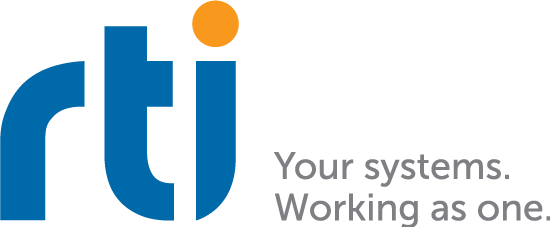

<br />
<p align="center">
  <a href="https://github.com/rticommunity/connextdds-py">
    
  </a>
</p>


<p align="center"><h1 align="center"><strong>RTI Connext Python API</strong></h1></p>

<p align="center">
  <br />
  <a href="https://community.rti.com/static/documentation/connext-dds/current/doc/manuals/connext_dds_professional/getting_started_guide/index.html">Getting Started</a>
  ·
  <a href="https://community.rti.com/static/documentation/connext-dds/current/doc/api/connext_dds/api_python/overview.html">API Overview</a>
  ·
  <a href="https://community.rti.com/static/documentation/connext-dds/current/doc/api/connext_dds/api_python/quick.html">API Reference</a>
  ·
  <a href="https://community.rti.com/static/documentation/connext-dds/current/doc/api/connext_dds/api_python/examples.html">Examples</a>
</p>

<br>


The Connext Python API can be installed with `pip` as follows:

```
pip install rti.connext
```

See the [Connext Getting Started Guide](https://community.rti.com/static/documentation/connext-dds/current/doc/manuals/connext_dds_professional/getting_started_guide/index.html)
for more information to install the software and run your first RTI Connext Python application while learning general concepts of Connext.

Note: starting with Connext 7.2.0, the Connext Python API is **no longer
distributed as buildable source**. This repository only contains the source for older versions.